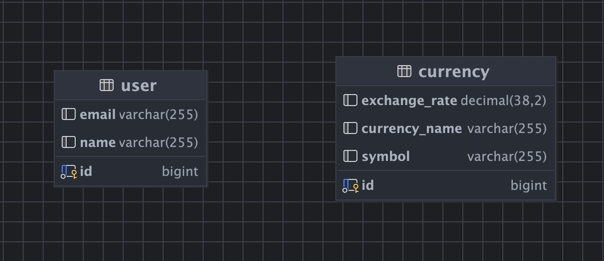

# 환전 프로젝트 만들기

## Currency(통화) API 명세서

|    기능    |Method|URL|Request| Response |    상태코드     |
|:--------:|:---:|:---:|:-----:|:--------:|:-----------:|
|  통화 등록   |POST|/api/currencies|요청 body|  등록 정보   | 201 Created | 
| 특정 통화 조회 |GET|/api/currencies/{id}|| 단건 응답 정보 |   200 OK    |
| 전체 통화 조회 |GET|/api/currencies|| 다건 응답 정보 |   200 OK    |


<details>
    <summary>통화 등록</summary> 

- 설명

|기능|Method|URL|Request|Response|상태코드|
|:---:|:---:|:---:|:-----:|:-----:|:-----:|
|  통화 등록   |POST|/api/currencies|요청 body|  등록 정보   | 201 Created | 

- 요청

등록할 환전 데이터를 JSON 형식으로 요청합니다.

|파라미터|타입| 필수여부 |           설명           |
|:---:|:---:|:----:|:----------------------:|
|currencyName|String|  Y   | 통화 이름(50자를 넘을 수 없습니다.) |
|exchangeRate|BigDecimal|  Y   | 환율|
|symbol|String|  Y   |표시(50자를 넘을 수 없습니다.) |


- 참고사항

POST /api/currencies

Content-Type: application/json

- 요청 예시
```json

{
    "currencyName" : "USD",
    "exchangeRate" : "1430.00",
    "symbol" : "$"
}
```

- 응답

응답에 성공하면 결괏값을 JSON 형식으로 반환합니다.

|파라미터|타입| 필수여부 |           설명           |
|:---:|:---:|:----:|:----------------------:|
|id|String|  Y   |       통화 고유 식별자        |
|currencyName|String|  Y   | 통화 이름(50자를 넘을 수 없습니다.) |
|exchangeRate|BigDecimal|  Y   |           환율           |
|symbol|String|  Y   |           표시(50자를 넘을 수 없습니다.)            |
|createdAt|LocalDateTime|  Y   |          생성일           |
|modifiedAt|LocalDateTime|  Y   |          수정일           |

- 참고사항

HTTP/1.1 201 Created

Content-Type: application/json

- 응답 예시
```json
{
  "id": 1,
  "currencyName": "USD",
  "exchangeRate": 1430.00,
  "symbol": "$",
  "createdAt": "2024-11-28T20:55:09.198232",
  "modifiedAt": "2024-11-28T20:55:09.198232"
}
```

</details>

<details>
    <summary>특정 통화 조회</summary> 

- 설명

|기능|Method|URL|Request|Response|상태코드|
|---|---|---|---|---|---|
| 특정 통화 조회 |GET|/api/currencies/{id}|| 단건 응답 정보 |   200 OK    |

- 요청 X

- 참고사항

GET /api/currencies/{id}

- 응답

응답에 성공하면 결괏값을 JSON 형식으로 반환합니다.

|파라미터|타입|필수여부|설명|
|:---:|:---:|:---:|:-----:|
|id|String|  Y   |       통화 고유 식별자        |
|currencyName|String|  Y   | 통화 이름(50자를 넘을 수 없습니다.) |
|exchangeRate|BigDecimal|  Y   |           환율           |
|symbol|String|  Y   |           표시(50자를 넘을 수 없습니다.)            |
|createdAt|LocalDateTime|  Y   |          생성일           |
|modifiedAt|LocalDateTime|  Y   |          수정일           |

- 참고사항

HTTP/1.1 200 OK

Content-Type: application/json

- 응답 예시
```json
{
  "id": 1,
  "currencyName": "USD",
  "exchangeRate": 1430.00,
  "symbol": "$",
  "createdAt": "2024-11-28T20:55:09.198232",
  "modifiedAt": "2024-11-28T20:55:09.198232"
}
```


</details>

<details>
    <summary>전체 통화 조회</summary> 

- 설명

|기능|Method|URL|Request|Response|상태코드|
|---|---|---|---|---|---|
| 전체 통화 조회 |GET|/api/currencies|| 다건 응답 정보 |   200 OK    |

- 요청 X

- 참고사항

GET /api/currencies

- 응답

응답에 성공하면 결괏값을 JSON 형식으로 반환합니다.

|파라미터|타입|필수여부|설명|
|:---:|:---:|:---:|:-----:|
|id|String|  Y   |       통화 고유 식별자        |
|currencyName|String|  Y   | 통화 이름(50자를 넘을 수 없습니다.) |
|exchangeRate|BigDecimal|  Y   |           환율           |
|symbol|String|  Y   |           표시(50자를 넘을 수 없습니다.)            |
|createdAt|LocalDateTime|  Y   |          생성일           |
|modifiedAt|LocalDateTime|  Y   |          수정일           |

- 참고사항

HTTP/1.1 200 OK

Content-Type: application/json

- 응답 예시
```json
[
  {
    "id": 1,
    "currencyName": "USD",
    "exchangeRate": 1430.00,
    "symbol": "$",
    "createdAt": "2024-11-28T20:55:09.198232",
    "modifiedAt": "2024-11-28T20:55:09.198232"
  },
  {
    "id": 2,
    "currencyName": "USD",
    "exchangeRate": 1431.00,
    "symbol": "$",
    "createdAt": "2024-11-28T20:55:09.198232",
    "modifiedAt": "2024-11-28T20:55:09.198232"
  }
]
```
</details>

## 통화 SQL 작성

### CREAT (일정 테이블 생성)

```mysql
-- 테이블 생성 (currency)
CREATE TABLE currency
(
    id BIGINT AUTO_INCREMENT PRIMARY KEY COMMENT '통화 고유 식별자',
    currency_name VARCHAR(50) COMMENT '통화 이름',
    exchange_rate DECIMAL(38,2) COMMENT '환율',
    symbol VARCHAR(50) COMMENT '표시',
    created_at DATETIME(6) COMMENT '작성일',
    modified_at DATETIME(6) COMMENT '수정일'
);

```

### INSERT (통화 등록)
```mysql
-- currency 테이블에 데이터 삽입
INSERT INTO currency (id, currency_name, exchange_rate, symbol, created_at,modified_at) VALUES('1', 'USD', '1431.00', '$', now(), now());
INSERT INTO currency (id, currency_name, exchange_rate, symbol, created_at, modified_at) VALUES('2', 'USD', '1432.00', '$', now(), now());

```

### SELECT (특정 통화 조회 & 전체 통화 조회)

```mysql
-- currency 식별자로 단건 조회
SELECT * FROM currency WHERE id = 1;

-- currency 전체 조회
SELECT * FROM currency;

```


## User API 명세서

|    기능    |Method|      URL      |Request| Response |         상태코드         |
|:--------:|:---:|:-------------:|:---:|:--------:|:--------------------:|
|  유저 등록   |POST|  /api/users   |요청 body|  등록 정보   |201 Created|
| 특정 유저 조회 |GET|/api/users/{id}|| 단건 응답 정보 |200 OK|
| 전체 유저 조회 |GET|  /api/users   || 다건 응답 정보 |200 OK|
|  유저 삭제   |DELETE|/api/users/{id}|| 삭제 안내 문구 |200 OK|

<details>
    <summary>유저 등록</summary> 

- 설명

|기능|Method|URL|Request|Response|상태코드|
|---|---|---|---|---|---|
|  유저 등록   |POST|  /api/users   |요청 body|  등록 정보   |201 Created|

- 요청

유저가 등록할 데이터를 JSON 형식으로 요청합니다.

|파라미터|타입|필수여부|            설명             |
|:---:|:---:|:---:|:-------------------------:|
|name|String|Y| 유저 이름 (100자를 넘을 수 없습니다.)  |
|email|String|Y| 유저 이메일 (100자를 넘을 수 없습니다.) |


- 참고사항

POST /api/users

Content-Type: application/json

- 요청 예시
```json

{
  "name" : "홍길동",
  "email" : "a@a.com"
}
```

- 응답

응답에 성공하면 결괏값을 JSON 형식으로 반환합니다.

|파라미터|타입|필수여부|설명|
|:---:|:---:|:---:|:-----:|
|id|String|Y|유저 고유 식별자|
|name|String|Y| 유저 이름 (100자를 넘을 수 없습니다.)  |
|email|String|Y| 유저 이메일 (100자를 넘을 수 없습니다.) |
|createdAt|LocalDateTime|Y|생성일|
|modifiedAt|LocalDateTime|Y|수정일|

- 참고사항

HTTP/1.1 200 OK

Content-Type: application/json

- 응답 예시
```json
{
  "id": 1,
  "name": "홍길동",
  "email": "a@a.com",
  "createdAt": "2024-11-28T20:55:09.198232",
  "modifiedAt": "2024-11-28T20:55:09.198232"
}
```

</details>

<details>
    <summary>특정 유저 조회</summary> 

- 설명

|기능|Method|URL|Request|Response|상태코드|
|---|---|---|---|---|---|
| 특정 유저 조회 |GET|/api/users/{id}|| 단건 응답 정보 |200 OK|

- 요청 X

- 참고사항

GET /api/users/{id}


- 응답

응답에 성공하면 결괏값을 JSON 형식으로 반환합니다.

|파라미터|타입|필수여부|설명|
|:---:|:---:|:---:|:-----:|
|id|String|Y|유저 고유 식별자|
|name|String|Y| 유저 이름 (100자를 넘을 수 없습니다.)  |
|email|String|Y| 유저 이메일 (100자를 넘을 수 없습니다.) |
|createdAt|LocalDateTime|Y|생성일|
|modifiedAt|LocalDateTime|Y|수정일|

- 참고사항

HTTP/1.1 200 OK

- 응답 예시
```json
{
  "id": 1,
  "name": "홍길동",
  "email": "a@a.com",
  "createdAt": "2024-11-28T20:55:09.198232",
  "modifiedAt": "2024-11-28T20:55:09.198232"
}
```

</details>

<details>
    <summary>전체 유저 조회</summary> 

- 설명

|기능|Method|URL|Request|Response|상태코드|
|---|---|---|---|---|---|
| 전체 유저 조회 |GET|  /api/users   || 다건 응답 정보 |200 OK|

- 요청 X

- 참고사항

GET /api/users


- 응답

응답에 성공하면 결괏값을 JSON 형식으로 반환합니다.

|파라미터|타입|필수여부|설명|
|:---:|:---:|:---:|:-----:|
|id|String|Y|유저 고유 식별자|
|name|String|Y| 유저 이름 (100자를 넘을 수 없습니다.)  |
|email|String|Y| 유저 이메일 (100자를 넘을 수 없습니다.) |
|createdAt|LocalDateTime|Y|생성일|
|modifiedAt|LocalDateTime|Y|수정일|

- 참고사항

HTTP/1.1 200 OK

- 응답 예시
```json
[
  {
    "id": 1,
    "name": "홍길동1",
    "email": "a@a.com",
    "createdAt": "2024-11-28T20:55:09.198232",
    "modifiedAt": "2024-11-28T20:55:09.198232"
  },
  {
    "id": 2,
    "name": "홍길동2",
    "email": "b@b.com",
    "createdAt": "2024-11-28T20:55:09.198232",
    "modifiedAt": "2024-11-28T20:55:09.198232"
  }
]
```

</details>


<details>
    <summary>유저 삭제</summary> 

- 설명

|기능|Method|URL|Request|Response|상태코드|
|---|---|---|---|---|---| 
|  유저 삭제   |DELETE|/api/users/{id}|| 삭제 안내 문구 |200 OK|

- 요청 X

- 참고사항

DELETE /api/users/{id}

- 응답 

- 참고사항

HTTP/1.1 200 OK

- 응답 예시

  "정상적으로 삭제되었습니다."

</details>


## 유저 SQL 작성

### CREAT (유저 테이블 생성)

```mysql
-- 테이블 생성 (user)
CREATE TABLE user
(
    id BIGINT AUTO_INCREMENT PRIMARY KEY COMMENT '유저 고유 식별자',
    name VARCHAR(100) COMMENT '유저명',
    email VARCHAR(100) COMMENT '유저 이메일',
    created_at DATETIME(6) COMMENT '작성일',
    modified_at DATETIME(6) COMMENT '수정일'
);

```

### INSERT (유저 등록)
```mysql
-- user 테이블에 데이터 삽입
INSERT INTO user (id, name, email, created_at, modified_at) VALUES('1', '홍길동', "a@a.com", now(), now());
INSERT INTO user (id, name, email, created_at, modified_at) VALUES('2', '김길동', "b@b.com", now(), now());
```

### SELECT (특정 유저 조회 & 전체 유저 조회)

```mysql
-- user 식별자로 단건 조회
SELECT * FROM user WHERE id = 1;

-- currency 전체 조회
SELECT * FROM user;

```


### DELETE (유저 삭제)

```mysql
-- 식별자 1번의 user 삭제
DELETE FROM user WHERE id = 1;
```


## ERD 설계
    - E(Entity. 개체)
        - 구현 할 서비스의 영역에서 필요로 하는 데이터를 담을 개체를 의미합니다.
            - ex) '통화', '유저'
            
    - A(Attribute. 속성)
        - 각 개체가 가지는 속성을 의미합니다.
            - ex) 
            
            통화 : '통화 id', '통화 이름', '환율', '표시'
            유저 : '유저 id', '유저명', '이메일'
            
    - R(Relationship. 관계)
        - 개체들 사이의 관계를 정의합니다.

        한 유저는 여러 통화로 환전할 수 있고 한 통화는 여러 유저들에 의해 환전될 수 있다.(양방향) 이때, 유저와 통화의 관계는 다대다(N:N) 관계입니다.


